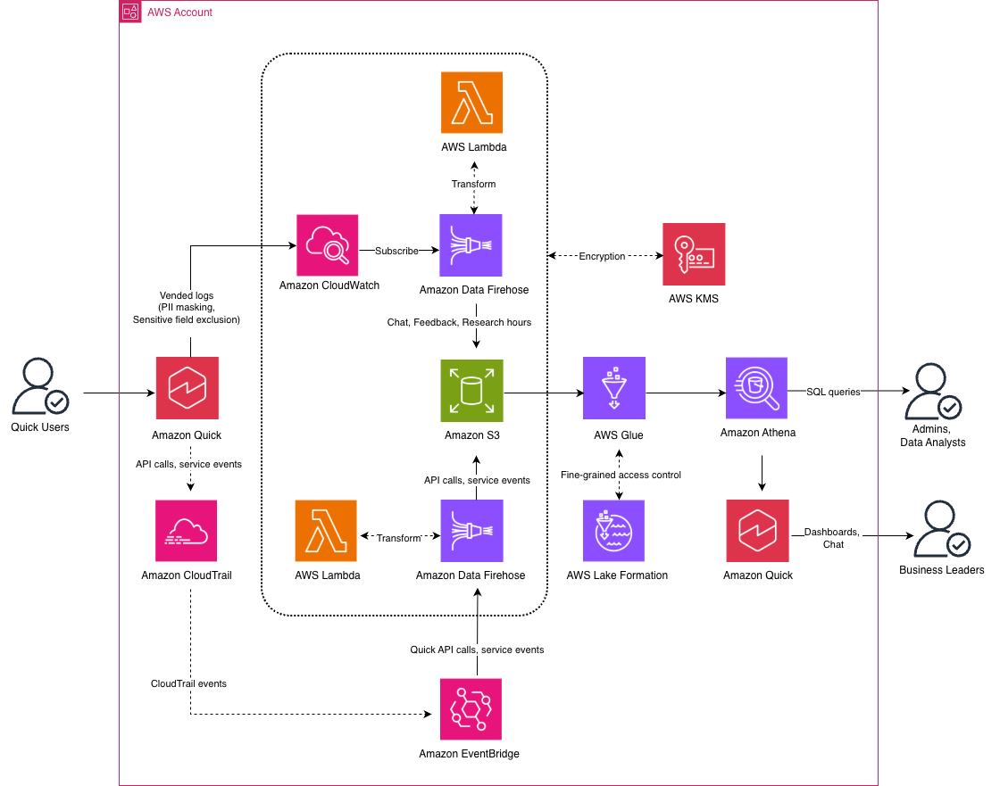

# Amazon Quick Observability Platform

Build an enterprise observability solution for Amazon Quick. Captures chat interactions, user feedback, agent hours, index usage, and API audit trails into an encrypted S3 data lake queryable through Amazon Athena, with a pre-built Quick Sight dashboard and custom chat agent for visual and conversational analytics.

## Table of Contents

- [Overview](#overview)
- [Security](#security)
- [Architecture](#architecture)
- [Prerequisites](#prerequisites)
- [Deployment](#deployment)
- [Validate and Test](#validate-and-test)
- [Troubleshooting](#troubleshooting)
- [Project Structure](#project-structure)
- [Clean Up](#clean-up)
- [References](#references)
- [Contributing](#contributing)
- [License](#license)

## Overview

Amazon Quick generates operational data across Amazon CloudWatch and AWS CloudTrail. This solution collects, transforms, and consolidates that data:

| Data source | What it captures | How this solution ingests it |
|-------------|-----------------|------------------------------|
| [CloudWatch Logs](https://docs.aws.amazon.com/quick/latest/userguide/monitoring-quicksuite-chat-feedback-cloudwatch.html) | Chat conversations, user feedback (thumbs up/down with reasons), agent hours consumption, index storage usage per source | Vended logs delivery → CloudWatch Log Groups → Subscription Filters → Firehose (Lambda transform) → S3 |
| [CloudTrail](https://docs.aws.amazon.com/quick/latest/userguide/incident-response-logging-and-monitoring-qs.html) | API calls and service events (dashboard views, user management, CRUD operations), user identity, source IP | EventBridge rule (filters `aws.quicksight` API calls and service events) → Firehose (Lambda transform) → S3 |

All data is encrypted at rest with a customer-managed KMS key (auto-rotation enabled) and in transit over HTTPS. A KMS key policy grants each service principal only the specific KMS actions it needs. CloudWatch Logs data protection policies on all four log groups (chat, feedback, agent hours, and index usage) use all available managed data identifiers to detect and mask sensitive data including credentials, financial information, PII, PHI, and device identifiers. Every IAM role is scoped to the minimum permissions required, and all CDK stacks pass [cdk-nag AWS Solutions](https://github.com/cdklabs/cdk-nag) checks with zero non-compliant findings.

## Security

> **Note:** This solution is a sample implementation intended for demonstration and proof-of-concept purposes. It is not intended as a production-ready solution. You are responsible for determining how the [AWS Shared Responsibility Model](https://aws.amazon.com/compliance/shared-responsibility-model/) applies to your specific use case and for implementing the controls needed to achieve your desired security outcomes. AWS offers a broad set of security tools and configurations to help you meet your objectives.

See [CONTRIBUTING](CONTRIBUTING.md#security-issue-notifications) for more information.

This solution follows the [AWS Shared Responsibility Model](https://aws.amazon.com/compliance/shared-responsibility-model/). AWS manages the security of the underlying cloud infrastructure, while you are responsible for securing your configuration, IAM policies, data, and access controls.

This solution applies defense-in-depth across encryption, access control, data protection, and compliance validation:

- **Encryption at rest** — All data is encrypted with a customer-managed KMS key (`enable_key_rotation=True`). The same key encrypts CloudWatch Log Groups, S3 objects (with S3 Bucket Key), Firehose delivery streams, and Lambda environment variables.
- **Encryption in transit** — The S3 data lake bucket enforces HTTPS-only access (`enforce_ssl=True`).
- **PII masking** — CloudWatch Logs [data protection policies](https://docs.aws.amazon.com/AmazonCloudWatch/latest/logs/mask-sensitive-log-data.html) on all four log groups (chat, feedback, agent hours, and index usage) use all available managed data identifiers to detect and mask sensitive data including credentials (e.g. AWS secret keys, private keys), financial information (e.g. credit card numbers, bank account numbers), PII (e.g. driver's licenses, social security numbers, passport numbers, email addresses, phone numbers), PHI (e.g. health insurance numbers, Medicare beneficiary numbers), and device identifiers (e.g. IP addresses).
- **Sensitive content control** — Chat message content (`user_message`, `system_text_message`) may contain sensitive or regulated data from connected enterprise sources. Before enabling message content logging, review your organization's data privacy, compliance, and data retention policies. By default, Quick omits these fields from the CloudWatch log events entirely. When message content logging is enabled, Lake Formation column-level exclusion prevents the Quick Sight service role from accessing these columns, while the deploying admin retains full access for Athena queries. This is configurable at deployment time.
- **Least-privilege IAM** — Each IAM role is scoped to the minimum permissions required. The Firehose role can only write to specific S3 prefixes (`cloudwatch-logs/*`, `cloudtrail/*`, `errors/*`). Lambda has no S3 access — Firehose writes to S3, not Lambda. The KMS key policy grants each service principal only the specific KMS actions it needs.
- **S3 hardening** — The data lake bucket enables versioning, blocks all public access (`BlockPublicAccess.BLOCK_ALL`), and enforces SSL.
- **Compliance validation** — All CDK stacks are checked with [cdk-nag AWS Solutions](https://github.com/cdklabs/cdk-nag) (`AwsSolutionsChecks`) with zero non-compliant findings. Suppressions are documented with explicit justifications in the CDK code.
- **Amazon EventBridge** — The EventBridge rule filters only for `source: aws.quicksight` events. The EventBridge IAM role is scoped to `firehose:PutRecord` and `firehose:PutRecordBatch` on a single Firehose delivery stream ARN.
- **AWS Glue Data Catalog** — The Glue database is created with a unique name (the script rejects existing databases). When Lake Formation is enabled, database and table permissions are granted explicitly to the deploying identity and the Quick Sight service role.
- **Amazon Athena** — Athena queries run within a user-specified workgroup. Query results encryption depends on the workgroup configuration (customer responsibility). Partition projection is used for table definitions, eliminating the need for dynamic partition management.
- **Amazon Quick Sight** — Quick Sight resources (data source, datasets, analysis, dashboard) are created with owner-only permissions. The Athena data source uses SSL. SPICE datasets use scheduled refresh (not live queries). Lake Formation column-level exclusion controls which data the Quick Sight service role can access.

## Architecture



The solution deploys three CDK stacks, two script-based steps, and one manual console step:
- **LogsStack** (`{prefix}-logs`): KMS key, CloudWatch Log Groups with data protection policies, vended logs delivery configuration
- **PipelineStack** (`{prefix}-pipeline`): S3 data lake, Firehose delivery streams, Lambda transform functions, EventBridge rule, CloudWatch Logs subscription filters
- **QuickSightStack** (`{prefix}-quicksight`): Custom theme, Athena data source, SPICE datasets with daily refresh, analysis, and dashboard

The data catalog (Glue database, Athena tables, views, optional Lake Formation) is created by `scripts/setup_datacatalog.py`, not by CDK. The Quick Sight topic is created by `scripts/create_topic.py`, also outside CDK. The custom chat agent is created manually in the Amazon Quick console.

## Prerequisites

- AWS CLI v2
- Python 3.9+
- Node.js 20+ (also provides `npx` for running CDK CLI)
- AWS CDK CLI (`npm install -g aws-cdk`) or `npx` (auto-detected by `deploy.py`)
- Amazon Quick subscription (Professional or Enterprise)

### Deploying from Windows

This solution was developed and tested on macOS and Linux. To deploy from Windows, apply the following modifications:

**`cdk/cdk.json`**
- Change `"app": ".venv/bin/python3 app.py"` to `"app": "python app.py"`

**`deploy.py`**
- In `setup_venv()`, replace `"python3"` with `sys.executable`
- In `get_venv_python()`, return `Scripts/python.exe` instead of `bin/python3`
- In `deploy_cdk()` and `bootstrap_cdk()`, add `shell=(os.name == "nt")` to `subprocess.run` calls that invoke CDK
- In `deploy_cdk()`, add `env["HOME"] = os.environ.get("USERPROFILE", os.path.expanduser("~"))` to the environment dict passed to CDK

**`cleanup.py`**
- In `destroy_cdk_stack()`, add `shell=(os.name == "nt")` to the `subprocess.run` call
- In `destroy_cdk_stack()`, add `env["HOME"] = os.environ.get("USERPROFILE", os.path.expanduser("~"))` to the environment dict passed to CDK

**`scripts/create_topic.py`**
- Change `os.path.join("cdk", ".venv", "bin", "python3")` to `os.path.join("cdk", ".venv", "Scripts", "python.exe")`

### IAM permissions

The deploying identity needs permissions to create and manage the following AWS resources: a customer-managed KMS key with key policies and aliases, CloudWatch Log Groups with data protection policies and vended logs delivery configuration, an S3 bucket with encryption and bucket policies, Lambda functions with IAM execution roles, Amazon Data Firehose delivery streams, EventBridge rules, CloudWatch Logs subscription filters, and IAM roles with scoped policies for each service. The identity also needs permission to deploy and destroy CloudFormation stacks (used by CDK), assume CDK bootstrap roles, and call `sts:GetCallerIdentity` for account and region detection.

For Amazon Quick specifically, the identity needs `quicksight:AllowVendedLogDeliveryForResource` ([docs](https://docs.aws.amazon.com/quick/latest/userguide/monitoring-quicksuite-chat-feedback-cloudwatch.html)) to enable vended logs delivery, and read access to list namespaces, describe the account subscription, and list users. Step 4 (dashboards) additionally requires permissions to create and manage Quick Sight data sources, datasets, analyses, and dashboards.

Step 3 (data catalog) requires permissions to create a Glue database and run Athena queries to create tables and views. If Lake Formation access control is chosen, the deploying identity must also be a [Lake Formation administrator](https://docs.aws.amazon.com/lake-formation/latest/dg/getting-started-setup.html#create-data-lake-admin) with permissions to register S3 data locations, manage data lake permissions, and update the KMS key policy for the Lake Formation service-linked role.

## Deployment

A single `deploy.py` script handles all deployment steps. Each step builds on the previous one. Settings are saved locally after each step so subsequent steps auto-populate profile, prefix, database name, and workgroup.

### Clone the repository

```bash
git clone https://github.com/aws-samples/sample-quick-observability-platform
cd sample-quick-observability-platform
```

The `deploy.py` script automatically creates a Python virtual environment, installs CDK dependencies, and bootstraps CDK on first run.

### Step 1: Set up CloudWatch Logs

```bash
python3 deploy.py --logs
```

Provisions (via CDK — LogsStack):
- Customer-managed KMS key with automatic rotation and key alias (`alias/{prefix}-observability`)
- CloudWatch Log Groups (chat, feedback, agent hours, index usage) — KMS encrypted
- [Data protection policy](https://docs.aws.amazon.com/AmazonCloudWatch/latest/logs/mask-sensitive-log-data.html) on all four log groups (chat, feedback, agent hours, and index usage) — uses all available managed data identifiers to detect and mask credentials, financial information, PII, PHI, and device identifiers
- Sensitive content control — chat message content (`user_message`, `system_text_message`) may contain sensitive or regulated data from connected enterprise sources. Before enabling message content logging, review your organization's data privacy, compliance, and data retention policies. The deployment prompts whether to include this content. When excluded (default), Quick omits these fields from the CloudWatch log events entirely
- Delivery Sources linking Amazon Quick to CloudWatch (log types: `CHAT_LOGS`, `FEEDBACK_LOGS`, `AGENT_HOURS_LOGS`, `INDEX_USAGE_LOGS`)
- Delivery Destinations pointing to the log groups
- Deliveries connecting sources to destinations. The chat delivery requests all optional fields (latency, time_to_first_token, surface_type, web_search, namespace) for detailed performance data. The feedback delivery includes research_id and namespace. The agent hours delivery includes service_resource_arn. The index usage delivery includes consumed_index_size, source_type, source_name, source_arn, consumed_source_size, consumed_source_doc_count, resource_arn, and user_arn.
- KMS key policy grants for `delivery.logs.amazonaws.com`, `logs.{region}.amazonaws.com`, and the Quick Sight service role

Prompts for: resource prefix, AWS CLI profile, log group names (defaults provided), message content opt-in. Auto-detects the Amazon Quick subscription region.

**After this step**, any Amazon Quick activity generates logs in CloudWatch. To start generating data:
- **Chat logs**: Ask questions using the Amazon Quick chat agent (My Assistant)
- **Feedback logs**: Provide thumbs up/down feedback on chat responses
- **Agent hours logs**: Use Quick Flows, Research, or Automations
- **Index usage logs**: Generated automatically when knowledge base or Space content changes (created, updated, synced, or deleted)
- **CloudTrail events**: Generated automatically by any Amazon Quick console or API activity

Data flows to CloudWatch within minutes of generating activity.

### Step 2: Deploy data pipeline

```bash
python3 deploy.py --pipeline
```

Prerequisites: Step 1 completed (`cdk/cdk-outputs.json` must exist with LogsStack outputs).

Provisions (via CDK — PipelineStack, imports KMS key from Step 1):
- S3 bucket (versioned, HTTPS enforced, Block Public Access, S3 Bucket Key enabled) — named `{stackname}-datalake-{account_id}`
- Lambda functions — LogTransform (Python 3.14, 512 MB, 300s timeout), CloudTrailTransform (Python 3.14, 512 MB, 300s timeout). Neither function has S3 access — Firehose writes to S3, not Lambda.
- Firehose delivery streams (128 MB / 900s buffer, GZIP compression, customer-managed KMS encryption) for chat, feedback, agent-hours, index-usage, cloudtrail — S3 write scoped to specific prefixes (`cloudwatch-logs/*`, `cloudtrail/*`, `errors/*`)
- Subscription Filters connecting Step 1 log groups to Firehose (via a CloudWatch Logs IAM role)
- EventBridge rule filtering `source: aws.quicksight`, `detail-type: ["AWS API Call via CloudTrail", "AWS Service Event via CloudTrail"]` — routes to CloudTrail Firehose via an EventBridge IAM role
- Glue Iceberg ETL job (`{prefix}-pipeline-iceberg-etl`) that reads landed raw JSON logs and writes Iceberg Parquet tables into `s3://{datalake-bucket}/iceberg/`
- Optional EventBridge schedule (`{prefix}-pipeline-IcebergRefresh`) that runs the Glue Iceberg ETL job periodically (enabled automatically once Iceberg mode is selected in Step 3)

Prompts for: confirmation only. Uses saved resource prefix, AWS CLI profile, and region from Step 1. Reads KMS key and log group config from Step 1 outputs.

**After this step**, data flows to S3 within 15–20 minutes of generating activity in Amazon Quick.

### Step 3: Set up the data catalog

```bash
python3 deploy.py --datacatalog
```

Prerequisites: Step 2 completed. An existing S3 bucket for Athena query results. If choosing Lake Formation, the deploying identity must be a Lake Formation administrator.

Runs `scripts/setup_datacatalog.py` which provisions:
- Glue database (user-defined name, must be new — the script rejects existing databases)
- Athena tables with partition projection (`year/month/day`):
  - `chat_logs` — timestamp, log_group, log_stream, message_type, user_arn, user_type, agent_id, flow_id, conversation_id, system_message_id, user_message_id, user_selected_resources, status_code, message_scope, action_connectors, cited_resource, file_attachment, resource_arn, account_id, event_timestamp, namespace, latency, time_to_first_token, surface_type, web_search
  - `feedback_logs` — timestamp, log_group, log_stream, message_type, user_arn, user_type, conversation_id, system_message_id, user_message_id, research_id, feedback_type, feedback_reason, feedback_details, rating, status_code, resource_arn, account_id, event_timestamp, namespace
  - `agent_hours_logs` — timestamp, log_group, log_stream, message_type, user_arn, subscription_type, reporting_service, usage_group, usage_hours, service_resource_arn, resource_arn, account_id, event_timestamp
  - `cloudtrail_events` — timestamp, event_id, event_name, event_source, event_type, event_category, aws_region, source_ip, user_agent, user_type, principal_id, user_name, user_arn, account_id, recipient_account_id, shared_event_id, read_only, error_code, error_message, request_parameters, response_elements, service_event_details, resources, resource_type, resource_arn
  - `index_usage_logs` — timestamp, log_group, log_stream, message_type, user_arn, consumed_index_size, source_type, source_name, source_arn, consumed_source_size, consumed_source_doc_count, resource_arn, account_id, event_timestamp
- Athena views:
  - `chat_activity` — conversations with feature classification (System Chat Agent (My Assistant), Custom Chat Agent, Flow), user name extraction, latency, surface type
  - `feedback_analysis` — user satisfaction (Useful/Not Useful), feedback reasons, free-text details, Research vs Chat source
  - `agent_hours_usage` — hours by service (RESEARCH, FLOW, AUTOMATION), resource type, included vs extra
  - `api_audit_trail` — CloudTrail API calls categorized by feature, read vs write, error codes, caller identity
  - `querydatabase_events` — database query events from CloudTrail with datasource_id, query_id, dashboard_or_analysis_id, dataset_id, dataset_mode
  - `index_usage` — per-source storage metrics with consumed_index_size_gb, consumed_source_size_gb, consumed_source_size_mb, source_type (SPACE, KB), source_name, consumed_source_doc_count, user_name extraction
- Lake Formation permissions (optional — prompted during setup): S3 data location registration, KMS key policy update for Lake Formation service-linked role, DATA_LOCATION_ACCESS grants, database-level grants, per-table SELECT/DESCRIBE grants for the caller and Quick Sight service role. When message content logging is enabled, the Quick Sight service role grant on `chat_logs` uses column-level exclusion to prevent access to `user_message` and `system_text_message` — the admin caller retains full access to all columns.

Step 3 now prompts for table storage format:
- **External JSON tables (default)** — same behavior as before (directly queries landed Firehose JSON files).
- **Iceberg tables via Glue ETL** — starts the Glue Iceberg ETL job from Step 2, creates/updates Iceberg tables (`chat_logs`, `feedback_logs`, `agent_hours_logs`, `cloudtrail_events`, `index_usage_logs`), then creates views on top.

Prompts for: AWS CLI profile, Athena database name, workgroup name, S3 location for query results, and access control mode (Lake Formation or IAM). If message content logging was enabled in Step 1, the `chat_logs` table includes `user_message` and `system_text_message` columns.

> **Note:** This solution grants data lake and Athena table/view access to the `aws-quicksight-service-role-v0` IAM role. In cross-account configurations or when using Athena federation, Amazon Quick may use `aws-quicksight-s3-consumers-role-v0` instead. If your environment uses `aws-quicksight-s3-consumers-role-v0` or a custom IAM role, grant that role the required permissions (S3 read access to the data lake bucket, Athena query execution, Glue Data Catalog access, and KMS decrypt) and update the Lake Formation grants to reference it.

**After this step**, verify data is flowing to all Athena tables:

```sql
SELECT COUNT(*) FROM quickobserve_db.chat_logs;
SELECT COUNT(*) FROM quickobserve_db.feedback_logs;
SELECT COUNT(*) FROM quickobserve_db.agent_hours_logs;
SELECT COUNT(*) FROM quickobserve_db.cloudtrail_events;
SELECT COUNT(*) FROM quickobserve_db.index_usage_logs;
```

### Step 4: Set up Quick Sight dashboard

```bash
python3 deploy.py --dashboard
```

Prerequisites: Step 3 completed (`cdk/datacatalog-config.json` must exist).

Provisions (via CDK — QuickSightStack):
- Custom theme (RAINIER base, Amazon Ember font, custom data color palette and UI color palette)
- Athena data source in Quick Sight (SSL enabled)
- SPICE datasets with Custom SQL, LogicalTableMap with ProjectOperation, and daily refresh schedules (06:00 UTC):
  - **Chat Activity** — conversations by feature, latency, surface type (queries `chat_logs` table)
  - **Feedback Analysis** — feedback type, reasons, details, Research vs Chat source (queries `feedback_logs` table)
  - **Agent Hours Usage** — hours by service, resource type parsed from ARN, included vs extra (queries `agent_hours_logs` table)
  - **API Audit Trail** — CloudTrail API calls and service events categorized by feature (queries `cloudtrail_events` table)
  - **Index Usage** — per-source storage metrics, consumed index size, source type breakdown (queries `index_usage` view)
- Analysis and dashboard with date range parameter controls (StartDate, EndDate) and per-sheet time range filters, each sheet with a detail table and DATA_POINT_CLICK filter actions (clicking any chart element filters the detail table on the same sheet):
  - **Chat Agents Usage** — Active Users KPI, Total Chat Sessions KPI, User Adoption Trend (line), Chat Sessions by Feature (bar), Top Users by Chat Sessions (bar), Feature Adoption Over Time (line, grouped by feature), Sessions by Status (bar), Chat Session Details (table)
  - **Hours Spent on Research, Flow, Automation** — Total Agent Hours KPI, Agent Hours by Service (pie), Top Users by Agent Hours (bar), Included vs Extra Hours (pie), Agent Hours Trend by Service (line, grouped by service), Agent Hours Details (table)
  - **User Feedback** — Satisfaction Distribution (pie), Top Feedback Reasons (bar), Feedback Details (table)
  - **Governance & Admin Activity** — API Activity by Feature (bar), API Callers by Identity Type (pie), Recent API Operations (table)
  - **Index Storage Usage** — Total Index Size KPI (GB), Storage by Source Type (pie), Index Storage Trend (line), Top Knowledge Bases by Size (bar), Top Spaces by Size (bar), Top Users by Storage (bar), All Sources Detail (table)

Uses saved AWS CLI profile, Athena database name, and workgroup from previous steps (prompts only if not saved). Auto-detects Quick Sight owner from caller identity (prompts for Quick Sight user ARN if auto-detection fails).

### Step 5: Create the Quick Sight topic

```bash
python3 scripts/create_topic.py
```

Prerequisites: Step 4 completed. Open the Quick Observability Dashboard in the Amazon Quick console and verify it shows data. If the dashboard has data, the SPICE datasets are populated and the topic creation will succeed.

The script auto-detects the AWS CLI profile and region from saved deployment config. To override:

```bash
python3 scripts/create_topic.py --profile <profile> --region <region>
```

The script reads dataset ARNs and the Quick Sight owner from `cdk/cdk-outputs.json` and `cdk/deploy-config.json`. It verifies each dataset has a successful SPICE ingestion with data before creating the topic. If any dataset is empty, it prints which ones need data and exits.

Creates:
- Quick Sight topic (`{prefix}-observability-topic`) named "Quick Observability" with `NEW_READER_EXPERIENCE` and `QBusinessInsightsEnabled`
- Field-level metadata: friendly names, descriptions, synonyms, semantic types, aggregation defaults, and data roles for each column across all datasets
- Custom instructions that route natural language questions to the correct dataset based on question type (adoption → Chat Activity, satisfaction → Feedback Analysis, cost → Agent Hours Usage, governance → API Audit Trail, storage → Index Usage)
- Owner permissions on the topic

### Step 6: Create a custom chat agent

Create an Amazon Quick [custom chat agent](https://docs.aws.amazon.com/quick/latest/userguide/custom-agents.html) that uses the Quick Sight topic from Step 5 to answer natural language questions about adoption, usage, cost, and governance. This step is performed through the Amazon Quick console.

**Create a Quick Space:**

1. Open the Amazon Quick console → **Spaces** → **Create space**
2. Enter a name and description for your space
3. Select **Add knowledge** → choose **Topics** → select **Quick Observability**

**Create a Quick custom chat agent:**

1. Open the Amazon Quick console → **Chat agents** → **Create chat agent**
2. Enter the following:
   - **Name**: `Quick Observability Insights`
   - **Description**: `Provides business leaders and administrators with actionable insights on Amazon Quick adoption, usage, performance, agent hours, costs, user satisfaction, and API activity using observability data.`
3. Under **Instructions**, paste the prompt from [`docs/Quick custom chat agent.txt`](docs/Quick%20custom%20chat%20agent.txt)
4. Under **Knowledge sources**, choose **Link Spaces** and select the Quick Observability space
5. Select **Launch chat agent** to publish the agent to the chat agent library

Users can ask questions like "Top features this month?", "Agent hours by service?", or "User satisfaction trends?" and receive data-driven answers with metrics, charts, and actionable recommendations.

### Clean up

```bash
python3 cleanup.py
```

The script reads `cdk/cdk-outputs.json` to detect all deployed stacks and runs the following steps in order. If any step fails, the script stops immediately and preserves configuration files so you can fix the issue and re-run.

1. Deletes the Quick Sight topic (created outside CDK by `scripts/create_topic.py`)
2. Destroys the Quick Sight CDK stack (theme, data source, datasets, refresh schedules, analysis, dashboard)
3. Cleans up Lake Formation if it was used (auto-detected from `cdk/datacatalog-config.json`): deregisters the S3 data location and revokes grants for the caller and Quick Sight service role
4. Drops the Athena database with CASCADE (removes all tables and views)
5. Destroys the Pipeline CDK stack (S3, Lambda, Firehose, EventBridge, subscription filters)
6. Destroys the Logs CDK stack (KMS key, Log Groups, vended logs delivery)
7. Removes local configuration files (`cdk-outputs.json`, `datacatalog-config.json`, `deploy-config.json`) and CDK output (`cdk.out/`)

The KMS key and S3 data lake bucket are retained by default (CDK removal policy). Delete them manually if no longer needed.

---

## Validate and test

### Validate CloudWatch Logs (after Step 1)

Generate activity in Amazon Quick (ask a question, provide feedback), then:

```bash
# Verify logs are flowing
aws logs tail /aws/vendedlogs/quick/chat --since 5m --format short
aws logs tail /aws/vendedlogs/quick/feedback --since 5m --format short
aws logs tail /aws/vendedlogs/quick/agent-hours --since 5m --format short
aws logs tail /aws/vendedlogs/quick/index-usage --since 5m --format short
```

```bash
# Verify delivery configuration
aws logs describe-deliveries --query "deliveries[*].[deliverySourceName,deliveryDestinationArn]" --output table
```

### Validate data pipeline (after Step 2)

Wait 15–20 minutes after generating activity, then:

```bash
# Check S3 for data (replace with your bucket name)
aws s3 ls s3://{stackname}-datalake-{account_id}/cloudwatch-logs/chat/ --recursive
aws s3 ls s3://{stackname}-datalake-{account_id}/cloudwatch-logs/index-usage/ --recursive
aws s3 ls s3://{stackname}-datalake-{account_id}/cloudtrail/ --recursive
```

```bash
# Check Firehose is receiving records (macOS syntax; on Linux replace -v-1H with --date='1 hour ago')
aws cloudwatch get-metric-statistics \
  --namespace AWS/Firehose \
  --metric-name IncomingRecords \
  --dimensions Name=DeliveryStreamName,Value={stackname}-chat-logs \
  --start-time $(date -u -v-1H +%Y-%m-%dT%H:%M:%S) \
  --end-time $(date -u +%Y-%m-%dT%H:%M:%S) \
  --period 300 --statistics Sum
```

```bash
# Check Lambda for errors
aws logs tail /aws/lambda/{stackname}-LogTransform --since 1h --format short
aws logs tail /aws/lambda/{stackname}-CloudTrailTransform --since 1h --format short
```

```bash
# Verify EventBridge rule is active
aws events describe-rule --name {stackname}-CloudTrailEvents --query State
```

### Validate Athena (after Step 3)

Query the `chat_logs`, `feedback_logs`, `agent_hours_logs`, `cloudtrail_events`, and `index_usage_logs` tables in the Athena console to verify data is flowing. Adjust the `year`/`month` partition values to match when you generated activity. Also verify the pre-built views (`chat_activity`, `feedback_analysis`, `agent_hours_usage`, `api_audit_trail`, `querydatabase_events`, `index_usage`) return results.

### Example queries

Query the `chat_activity`, `feedback_analysis`, `agent_hours_usage`, `api_audit_trail`, and `index_usage` views for observability insights:

```sql
-- Track adoption: daily active users and sessions
SELECT DATE(event_time) AS day,
       COUNT(DISTINCT user_name) AS active_users,
       COUNT(DISTINCT conversation_id) AS sessions
FROM {database}.chat_activity
GROUP BY DATE(event_time)
ORDER BY day DESC;

-- Measure overall satisfaction
SELECT satisfaction, COUNT(*) AS count,
       ROUND(COUNT(*) * 100.0 / SUM(COUNT(*)) OVER(), 1) AS percentage
FROM {database}.feedback_analysis
GROUP BY satisfaction;

-- Agent hours by service
SELECT service, usage_group,
       SUM(hours) AS total_hours,
       COUNT(DISTINCT user_name) AS users
FROM {database}.agent_hours_usage
GROUP BY service, usage_group
ORDER BY total_hours DESC;

-- API activity by feature (governance)
SELECT api_feature, read_or_write, COUNT(*) AS count
FROM {database}.api_audit_trail
GROUP BY api_feature, read_or_write
ORDER BY count DESC;

-- Top sources by consumed storage size (index usage)
SELECT source_name, source_type,
       MAX(consumed_index_size_gb) AS total_index_size_gb,
       MAX(consumed_source_size_gb) AS source_size_gb,
       MAX(consumed_source_doc_count) AS doc_count
FROM {database}.index_usage
GROUP BY source_name, source_type
ORDER BY source_size_gb DESC;
```

---

## Troubleshooting

| Symptom | Check |
|---------|-------|
| No logs in CloudWatch | Verify `quicksight:AllowVendedLogDeliveryForResource` IAM permission. Run `aws logs describe-deliveries` to confirm delivery exists. |
| Logs in CloudWatch but not in S3 | Wait 15–20 min (Firehose buffer is 128 MB / 900s). Check subscription filters: `aws logs describe-subscription-filters --log-group-name {log_group}`. Check Lambda errors. |
| Optional fields NULL (latency, TTFT) | Verify `record_fields` were included in the LogsStack delivery configuration. Redeploy: `python3 deploy.py --logs`. |
| Lake Formation permission errors | Run `python3 deploy.py --datacatalog` and choose Lake Formation access control to grant Quick Sight service role access. |
| Quick Sight dataset creation fails | Verify Lake Formation permissions (Step 3). Check that the Athena workgroup and data source are accessible. |
| Quick Sight topic questions return no results | Verify datasets have data via SPICE ingestion. Check that `event_time` is recognized as a date column in the topic configuration. |
| KMS access denied on log groups | Verify KMS key policy includes `delivery.logs.amazonaws.com`. Redeploy: `python3 deploy.py --logs`. |
| Lake Formation grant fails with SSO | The script auto-converts STS session ARNs to IAM role ARNs. Verify your SSO role is a Lake Formation administrator. |
| Cleanup fails on Athena drop | Verify the Athena workgroup has a query results location, or provide one when prompted. |

---

## Project structure

```
├── deploy.py                          # Deployment script (--logs, --pipeline, --datacatalog, --dashboard)
├── cleanup.py                         # Resource teardown script
├── CODE_OF_CONDUCT.md                 # Community guidelines
├── CONTRIBUTING.md                    # Contribution guidelines
├── LICENSE                            # MIT-0 license
│
├── cdk/                               # AWS CDK infrastructure
│   ├── app.py                         # CDK app entry point (cdk-nag enabled)
│   ├── logs_stack.py                  # LogsStack: KMS key, CloudWatch Log Groups, vended logs delivery
│   ├── pipeline_stack.py              # PipelineStack: S3, Firehose, Lambda, EventBridge, subscription filters
│   ├── dashboard_stack.py             # QuickSightStack: theme, data source, datasets, analysis, dashboard
│   ├── requirements.txt               # Python dependencies for CDK
│   ├── cdk.json                       # CDK configuration
│   └── README.md                      # CDK-specific documentation
│
├── lambda/                            # Lambda function source code
│   ├── log_transform/
│   │   ├── index.py                   # Chat, feedback, agent hours, index usage transform
│   │   └── README.md
│   └── cloudtrail_transform/
│       ├── index.py                   # CloudTrail event transform
│       └── README.md
│
├── sql/                               # Athena DDL statements
│   ├── create_chat_logs_table.sql
│   ├── create_feedback_logs_table.sql
│   ├── create_agent_hours_logs_table.sql
│   ├── create_cloudtrail_events_table.sql
│   ├── create_index_usage_logs_table.sql
│   ├── create_chat_activity_view.sql
│   ├── create_feedback_analysis_view.sql
│   ├── create_agent_hours_usage_view.sql
│   ├── create_api_audit_trail_view.sql
│   ├── create_querydatabase_events_view.sql
│   └── create_index_usage_view.sql
│
├── scripts/                           # Deployment helper scripts
│   ├── setup_datacatalog.py           # Creates Glue database, Athena tables/views, Lake Formation
│   └── create_topic.py               # Creates Quick Sight topic (requires data in SPICE datasets)
│
└── docs/                              # Documentation
    ├── sample-quick-observability-platform.png  # Solution architecture diagram
    └── Quick custom chat agent.txt    # Custom chat agent name, description, and prompt for Step 6
```

---

## References

- [Monitoring Amazon Quick usage using CloudWatch Logs](https://docs.aws.amazon.com/quick/latest/userguide/monitoring-quicksuite-chat-feedback-cloudwatch.html)
- [Incident response, logging, and monitoring using CloudTrail](https://docs.aws.amazon.com/quick/latest/userguide/incident-response-logging-and-monitoring-qs.html)
- [AWS CDK Documentation](https://docs.aws.amazon.com/cdk/)

## Contributing

See [CONTRIBUTING](CONTRIBUTING.md) for more information.

## License

This library is licensed under the MIT-0 License. See the [LICENSE](LICENSE) file.
